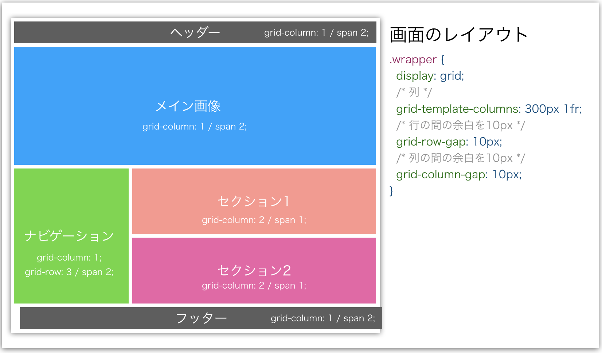
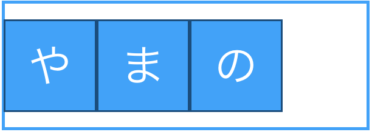
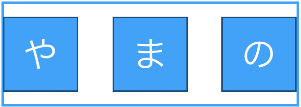
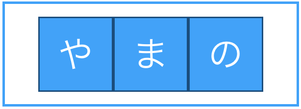

# CSSレイアウトを特徴で使い分ける
## Grid Layout, Flexbox, Floatの特徴
**Grid Layout, Flexbox, Float**はそれぞれCSSにおいてレイアウトを設定上で必要なプロパティとなっている。一昔前まではFloatだけでレイアウトを設定していたが、現在はより効率的にレイアウトを設定できるようにFlexboxやGrid Layoutが注目されている。それらの特徴をおさえて効率的にレイアウトを設定できる備忘録としていく。また新しくレイアウトの仕様が変わる毎にリライトしていく。

1. Grid Layout  
- 要素の順番やフローは無関係に、要素の配置される位置を指定できる  
- 整列された行や列に要素を配置できる  
- ヘッダー、コンテンツ、フッターのように画面を分割するようなレイアウトに向いている

2. Flexbox  
- 要素を整列させるのに向いている
- 要素を横並びに整列する際に余白を均等に揃えたり、整列する方向や順番も指定できる
- 要素の整列において少量のコードで様々なレイアウトを実現できる

3. Float  
- 指定された要素をleftやrightで左右に浮かせることができるため、要素の周りにテキストなどを回り込ませるようなレイアウトが実現できる

## それぞれが向いているレイアウトについて  
1. Grid Layout  
  

 
  Grid Layoutは画面全体を分割したようにレイアウトや、タイルレイアウトを組むのに適している

2. Flexbox  
- flex-start
  

 
- space-between
  

 
- center
  

 
- space-around
  

 
  Floatやその他のCSSプロパティだと面倒な等間隔の横並びや上下左右の中央寄せもFlexboxなら簡単に実現できる

3. Float
- float: left  
  

- float: right
  

  記事でよく見るように画像の周りに文字が回り込むようなレイアウトが実現できる
